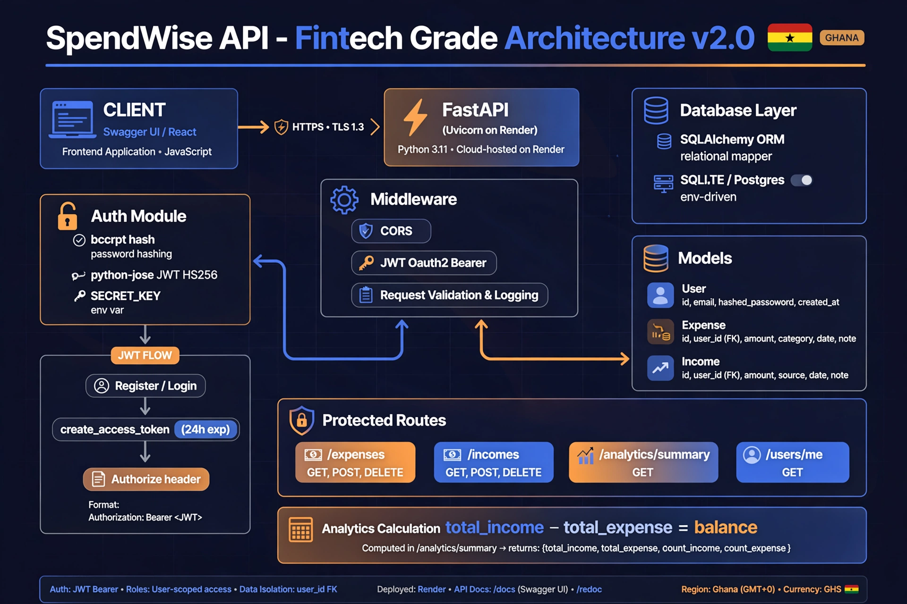

# SpendWise API - Fintech Grade v2.0 🇬🇭
> JWT Secured Expense & Income Tracker | Built in Ghana

**Live API:** https://spendwise-api-q6b6.onrender.com/docs  
**Swagger UI:** `/docs` | **ReDoc:** `/redoc`



### 🚀 Live Demo Proof

```json
{
  "user": "kofi",
  "total_income": 3000,
  "total_expense": 150,
  "balance": 2850,
  "expense_count": 1,
  "income_count": 1
}
```

### 📚 Endpoints

| Method | Endpoint | Auth | Description |
|---|---|---|---|
| POST | /register | ❌ | Create user + return JWT |
| POST | /login | ❌ | Login via OAuth2 Form |
| GET | /users/me | 🔒 | Current user |
| POST/GET/DELETE | /expenses/ | 🔒 | User-isolated expenses |
| POST/GET | /incomes/ | 🔒 | User-isolated incomes |
| GET | /analytics/summary | 🔒 | Total income/expense/balance |

### 🔐 How JWT Works

1. POST /register with username and password returns access_token
2. Click Authorize in /docs, Paste Bearer token OR use login form
3. All locked routes now send Authorization Bearer JWT header
4. Backend decodes sub claim, loads user, filters by user_id

### 🛠️ Run Locally

```bash
git clone https://github.com/randyotengacheampong-lgtm/spendwise-api.git
cd spendwise-api
pip install -r requirements.txt
uvicorn main:app --reload
# http://localhost:8000/docs
```

### 👨🏾‍💻 Author

**Randy Oteng Acheampong (Kofi)** - Ghanaian Backend Developer | Accra, GMT+0
- GitHub: [@randyotengacheampong-lgtm](https://github.com/randyotengacheampong-lgtm)
- Built with FastAPI + JWT + User-Isolated Architecture

### 📈 Phase 3 - Next

- React Dashboard
- Charts with Recharts
- GHS Currency & Mobile Money integration
- Deploy frontend to Vercel